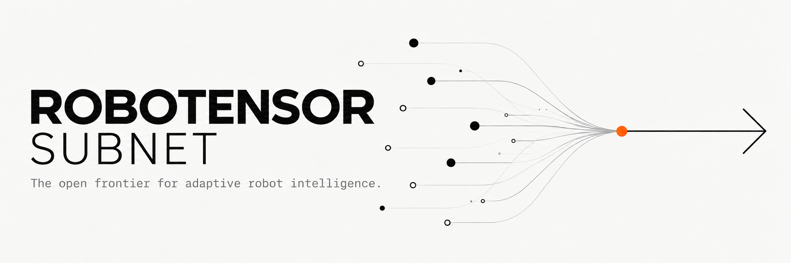

<p align="center">
  
</p>

<p align="center">
  <a href="LICENSE"></a>
  
  
</p>

<p align="center">
  <a href="#how-it-works">How it works</a> ·
  <a href="#mining">Mining</a> ·
  <a href="#validating">Validating</a> ·
  <a href="#development">Development</a>
</p>

---

**Attune** is a Bittensor subnet for robot foundation models, built by [Robotensor](https://www.robotensor.ai). Miners submit policy weights;
validators score them in simulation and set weights on chain.

The first competition is **Vector**: a policy (`vector_v1.1`) is shown one
demonstration of a task and must complete the same task in a different scene.

## How it works

| | |
|---|---|
| **Submission** | A Hugging Face model repo containing only `model.safetensors` (and an optional README). |
| **Commitment** | `vector:<owner>/<repo>@<commit>.<digest>` on chain: the revision and the sha256 of `model.safetensors`, in base64url. `attune miner commit` builds it; repo ids can be up to 49 characters long. |
| **Queue** | The validator queues a commitment as soon as it reads it from the chain, oldest first. **One submission per hotkey**: once a hotkey is queued, its later commitments are refused. |
| **Scoring** | King of the hill. Each queued submission duels the current king on 160 units (16 tasks × 10), seeded from the finalized block when the duel starts. That block must come after the commitment. The challenger takes the crown when its average success rate beats the king's by 3+ points. |
| **Rewards** | The lane's share goes to the 4 most recent champions: 40% / 30% / 20% / 10%, newest first. |

### Missing repositories

The Hub is checked when an entry's turn comes, not when it is queued.

- **Challenger missing.** If the Hub doesn't show the challenger's repo when its turn comes
  (deleted, still private, or the revision is gone), it is dropped as `missing` and the validator
  duels the next entry in the queue. The hotkey's one submission is used up.
- **King missing.** Before every duel, the validator checks that the king's repo is still on the
  Hub. If it is gone, the king is dethroned without a duel (a `vacate` record in the result store)
  and the next entry takes the empty throne. The dethroned king's champion place stays, but its
  share of the emission is **burned**.
- **Hub unreachable.** A Hub that doesn't answer counts as a missing repo, for the challenger and
  for the king alike.

Submissions are weights only. Nothing a miner uploads is executed or unpickled: the safetensors
header is checked against the pinned architecture before any tensor is read. Weights that don't
hash to the committed digest are refused. Weights identical to an earlier commitment's are refused
as duplicates, and the earlier commitment keeps them.

## Components

| Repo | Role |
|---|---|
| [`attune-subnet`](https://github.com/robotensor/attune-subnet) | Chain side: commitments, queue, seeds, weights, validator loop, miner CLI |
| [`vector-orchestrator`](https://github.com/robotensor/vector-orchestrator) | Duel engine, result store, `vector-runtime` and `vector-protocol` |
| [`RoboTwin-Vector`](https://github.com/robotensor/RoboTwin-Vector) | RoboTwin 2.0 fork with the level gate and the benchmark harness |

## Mining

A submission is a `vector_v1.1` weights file: `model.safetensors`, with exactly the tensors the
architecture pins (`vector_runtime/vector_v1.1.json` in the orchestrator).

```bash
pip install robotensor-attune

attune miner check --dir submission/

export HF_TOKEN=...
attune miner submit --dir submission/ --repo <you>/vector-mine \
    --network finney --netuid <N> --wallet.name miner --wallet.hotkey default
```

`submit` uploads to a private repo, commits on chain, then makes the repo public right away. The
earliest commitment of a given set of weights wins, so commit before you publish, but don't leave
the repo private: a repo the validator can't see at its turn is dropped as missing. Keep the repo up while you
hold a place: a king whose repo is gone is dethroned and its share is burned.

Check your entry with:

```bash
attune miner status --hotkey <ss58> --network finney --netuid <N>
```

## Validating

One GPU host with three Python environments:

| Env | Python | Contents |
|---|---|---|
| simulator | 3.10 | RoboTwin-Vector (`robotensor_bench/scripts/install_robotwin.sh`), `vector-protocol` |
| policy | 3.12 | torch 2.8.0+cu128, `vector-runtime[model]`, `vector-protocol` |
| host | 3.12 | `robotensor`, `vector-orchestrator`, `vector-runtime` |

```bash
git clone -b vector https://github.com/robotensor/RoboTwin-Vector.git
git clone https://github.com/robotensor/vector-orchestrator.git
git clone https://github.com/robotensor/attune-subnet.git

uv venv --python 3.12 .venvs/subnet
uv pip install --python .venvs/subnet/bin/python -e attune-subnet -e vector-orchestrator \
    -e vector-orchestrator/packages/vector-protocol -e vector-orchestrator/packages/vector-runtime
```

Point `[vector]` in `config/<network>.toml` at the environments and your wallet:

```toml
network = "finney"   # or "test"
netuid = 0
wallet = { name = "validator", hotkey = "default" }

[vector]
policy_python = "/abs/.venvs/vector-policy/bin/python"
simulator_python = "/abs/.venvs/robotwin/bin/python"
simulator_root = "/abs/RoboTwin-Vector"
workers = 1   # units per GPU; one unit can use up to 34 GB
```

```bash
export HF_TOKEN=...
attune validator --config config/<network>.toml run
```

`status`, `weights --dry-run` and `duel --challenger owner/name@sha` are also available.
Interrupted duels resume from `var/<network>/`.

For rented GPU pods (vast.ai, lium.io), `docker/build.sh` builds an image with all three
environments, the assets and the checkouts. Run `pod-check --selftest` on a new pod.

## Development

```bash
uv venv --python 3.12 .venv && uv pip install -e ".[dev]"
ruff check . && ruff format --check .
pytest -q -m "not chain and not gpu"
```

`scripts/localnet.sh up` and `scripts/localnet_setup.py` run the full loop against a local
subtensor.

### Releasing the miner package

Miners install `robotensor-attune` from PyPI: the `attune` command with `init` and `miner`
only, and none of the validator. `miner/build.sh` lays out the miner's modules and copies
vector-runtime's weights check from the vector-orchestrator checkout beside this one; it refuses
a tensor manifest that is not the one `spec.json` pins. The version is `__version__` in
`src/robotensor/__init__.py`.

```bash
bash miner/build.sh                     # miner/dist/robotensor_attune-<version>-py3-none-any.whl
twine upload miner/dist/robotensor_attune-<version>-py3-none-any.whl
```

Rebuild and upload whenever the miner's commands or the architecture change. Validators do not
install it: their install from source has the same commands.

## License

[Apache-2.0](LICENSE)
